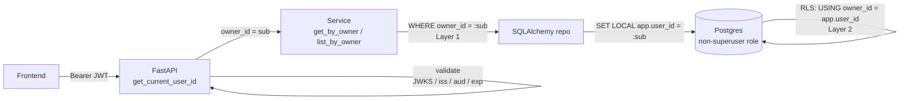
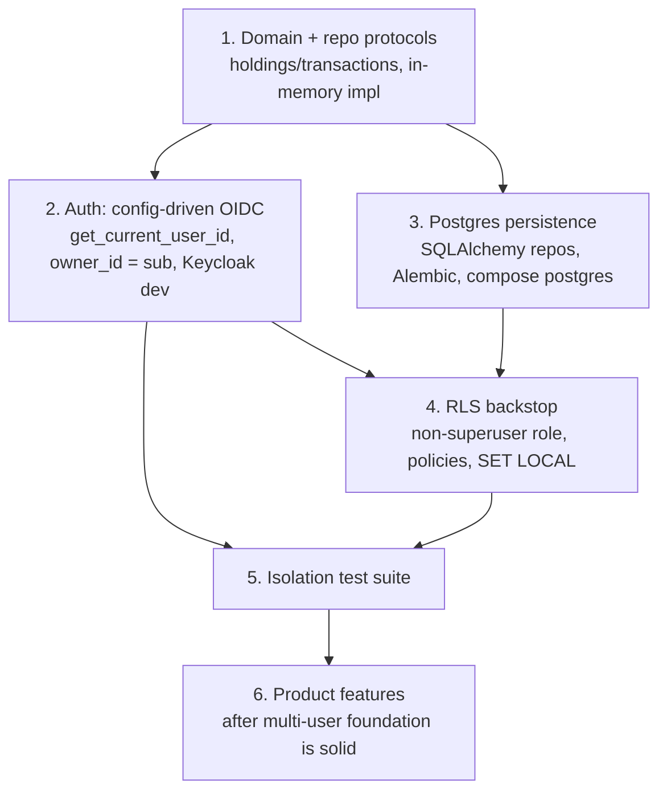

# Database design for multiple users

> **Status: proposed design — not yet implemented.**
> This document is a forward-looking design reference, not a description of code that
> exists today. As of this writing the backend (`server/app/`) is a **stateless
> market-data broadcaster**: it opens a Binance BTCUSDT websocket
> (`server/app/services/market_data.py`), computes rolling RSI/MACD/EMA indicators
> (`server/app/services/analysis.py`), and pushes ticks to connected clients over a public
> `/ws` websocket (`server/app/services/connection_manager.py`,
> `server/app/api/websocket.py`, wired in `server/app/main.py`). There is **no database, no
> authentication, no user model, and no per-user data** anywhere yet. Everything below
> describes the layer we are about to build.

## 1. Purpose & scope

The application will grow from a single shared market-data feed into a product that serves
**many users**, each of whom stores their own private records (portfolio holdings, trades,
watchlists, settings). The hard requirement:

> **A user must only ever be able to see or modify records they created. There is no path —
> accidental or malicious — by which user A reads or writes user B's data.**

This document specifies how we achieve that guarantee: how users are identified (SSO / OIDC),
how their identity becomes a per-row ownership key, and the **two independent layers** of
isolation (application query scoping + database Row-Level Security) that back the guarantee
up. It also gives a proposed schema and an ordered roadmap for building the whole thing.

It does **not** cover the market-data streaming that already exists, except to note where
that surface will eventually need the same auth treatment (§5).

## 2. Identity model

**An OIDC identity provider is the single source of truth for identity.** Users authenticate
against it (via SSO), and it issues the frontend a signed **JWT**. The token's `sub`
(subject) claim is a **stable, opaque, per-user identifier** — it does not change across
logins, and no two users share one. That `sub` is what we use as the ownership key.

```
JWT sub  ==  owner_id     (TEXT, opaque, stable)
```

The backend is deliberately **issuer-agnostic and configuration-driven**. It does not embed
any vendor SDK or issuer-specific logic. It trusts a token when, and only when:

- the signature verifies against the issuer's published JWKS, **and**
- the `iss` (issuer) claim matches the configured `OIDC_ISSUER`, **and**
- the `aud` (audience) claim matches the configured `OIDC_AUDIENCE`, **and**
- the token is unexpired (`exp`).

Because that logic is purely config-driven, the **same code** accepts Keycloak-issued tokens
in local development and Cognito-issued tokens in production (see §6). The `sub` _format_
differs by issuer (Keycloak emits a UUID; Amazon Cognito emits a pool-scoped subject), but
in both cases it is opaque and stable, so `owner_id` treats it as an **opaque `TEXT` key** —
never parse it, never assume a format.

### No local `users` table (initially)

We do **not** create a local `users` table to start with. `owner_id` is simply the `sub`
string, stored directly on each owned row.

- **Trade-off:** there is no foreign-key anchor for ownership and no "home" for user profile
  data (display name, preferences) inside our database. The IdP holds the profile.
- **Future migration (non-breaking):** when we need a profile store or FK integrity, add a
  `users` table keyed by the `sub`:

  ```sql
  CREATE TABLE users (
      id          TEXT PRIMARY KEY,   -- the OIDC sub
      created_at  TIMESTAMPTZ NOT NULL DEFAULT now(),
      -- profile columns as needed
  );
  ```

  Existing `owner_id` columns become `REFERENCES users(id)`. No data migration of the
  ownership keys is required because `owner_id` already _is_ the `sub`. Backfill `users` from
  the distinct `owner_id` values already present.

## 3. User-owned data model & schema (proposed)

There is no user-owned data today, so this section proposes the **first** owned domain — a
trading portfolio — as the worked example. Treat the two tables below as illustrative of a
**repeatable pattern**, not as the final schema.

> **The pattern — every user-owned table MUST:**
>
> 1. carry `owner_id TEXT NOT NULL`,
> 2. have an index on `owner_id` (and composite indexes leading with `owner_id` for hot
>    lookups),
> 3. store money as `NUMERIC`, never `float`/`double`,
> 4. have Row-Level Security enabled with an owner policy (§4).

### `holdings`

```sql
CREATE TABLE holdings (
    id             UUID PRIMARY KEY DEFAULT gen_random_uuid(),
    owner_id       TEXT        NOT NULL,
    symbol         TEXT        NOT NULL,
    exchange       TEXT        NOT NULL,
    quantity       NUMERIC(28,10) NOT NULL,
    average_cost   NUMERIC(28,10) NOT NULL,
    currency       TEXT        NOT NULL,
    notes          TEXT,
    created_at     TIMESTAMPTZ NOT NULL DEFAULT now(),
    updated_at     TIMESTAMPTZ NOT NULL DEFAULT now()
);

CREATE INDEX ix_holdings_owner ON holdings (owner_id);
```

### `transactions`

```sql
CREATE TABLE transactions (
    id          UUID PRIMARY KEY DEFAULT gen_random_uuid(),
    owner_id    TEXT        NOT NULL,
    holding_id  UUID        NOT NULL REFERENCES holdings (id) ON DELETE CASCADE,
    side        TEXT        NOT NULL CHECK (side IN ('buy', 'sell')),
    trade_date  DATE        NOT NULL,
    quantity    NUMERIC(28,10) NOT NULL,
    price       NUMERIC(28,10) NOT NULL,
    fees        NUMERIC(28,10) NOT NULL DEFAULT 0,
    created_at  TIMESTAMPTZ NOT NULL DEFAULT now()
);

-- Leading owner_id serves both "list this user's transactions" and
-- "this user's transactions for one holding".
CREATE INDEX ix_transactions_owner_holding ON transactions (owner_id, holding_id);
```

Notes:

- `owner_id` is stored **redundantly** on `transactions` (as well as being reachable via
  `holding_id -> holdings.owner_id`). This is intentional: it lets the RLS policy and the
  hot-path queries filter on `transactions.owner_id` directly, without a join, and lets RLS
  protect the table independently.
- The FK `transactions.holding_id -> holdings.id` gives referential integrity. Application
  code must additionally ensure a child's `owner_id` equals its parent's `owner_id` (enforce
  on write; optionally a trigger or composite FK `(holding_id, owner_id)` referencing a
  unique `(id, owner_id)` on `holdings` if you want the DB to guarantee it).
- **Float/Decimal boundary:** monetary and quantity values are `NUMERIC` in the database.
  In Python domain code they may be `Decimal` (preferred) or `float`; convert at the data
  layer. Never let a binary `float` reach a money column.

## 4. Isolation strategy — two independent layers

Isolation is enforced **twice**, by mechanisms that fail independently. Layer 1 is the
everyday guard; Layer 2 is the backstop that holds even if Layer 1 has a bug.



### Layer 1 (primary): application owner-scoping

Every read and write is scoped by `owner_id` in the query itself. To make this
**structural rather than a thing you must remember**, the repository interface is designed so
that an owner is never optional:

- Repository methods are named for scoping: `get_by_owner(owner_id, id)`,
  `list_by_owner(owner_id, ...)`, `update_for_owner(owner_id, id, ...)`,
  `delete_for_owner(owner_id, id)`.
- **There is no `get(id)` that takes a bare row id.** A service can only reach a row by
  supplying the caller's `owner_id`, so a mismatched id simply returns "not found" (a 404),
  never another user's row.

> **Rule:** services must never accept a raw row id without also carrying the authenticated
> caller's `owner_id`. If a method signature lets you look something up by id alone, that is
> a design bug.

### Layer 2 (backstop): Postgres Row-Level Security (RLS)

Even a query that _forgets_ its `WHERE owner_id` must not cross users. Postgres RLS enforces
that in the database:

```sql
-- The application connects as a NON-superuser role.
-- (RLS is bypassed by superusers and by any role with BYPASSRLS — the app role must have
--  neither.)

ALTER TABLE holdings      ENABLE ROW LEVEL SECURITY;
ALTER TABLE transactions  ENABLE ROW LEVEL SECURITY;

CREATE POLICY owner_isolation ON holdings
    USING      (owner_id = current_setting('app.user_id', true))   -- SELECT/UPDATE/DELETE
    WITH CHECK (owner_id = current_setting('app.user_id', true));  -- INSERT/UPDATE

CREATE POLICY owner_isolation ON transactions
    USING      (owner_id = current_setting('app.user_id', true))
    WITH CHECK (owner_id = current_setting('app.user_id', true));
```

Per request, inside the transaction, the backend binds the authenticated `sub` to a
session-local Postgres setting:

```sql
SET LOCAL app.user_id = '<the authenticated sub>';
```

- **Why `SET LOCAL` (not `SET`):** `SET LOCAL` is **transaction-scoped** — it is reset when
  the transaction ends. That is essential with a **connection pool**: a pooled connection is
  reused across requests for different users, and a plain `SET` would leak one user's
  `app.user_id` into the next user's request on the same physical connection. `SET LOCAL`
  cannot leak past the transaction.
- **Why the `true` second argument** to `current_setting('app.user_id', true)`: it makes the
  lookup **missing-ok** — if the setting was never set, it returns `NULL` instead of raising.
  A `NULL` never equals any `owner_id`, so a connection that forgot to set `app.user_id`
  sees **zero rows** (fails closed) rather than erroring or, worse, seeing everything.

Wire it up so it is automatic, not per-query: bind `app.user_id` in a SQLAlchemy session
dependency / an `after_begin` event handler that runs `SET LOCAL app.user_id = :sub` at the
start of every request transaction, using the `sub` from the authenticated request context.

**Net effect:** a bug in Layer 1 (a query missing `WHERE owner_id`) is contained by Layer 2;
the database itself refuses to return or accept rows for any other owner.

## 5. SSO / JWT request flow

```
1. User authenticates with the OIDC issuer (SSO login).
2. Issuer returns a signed JWT to the frontend.
3. Frontend calls the API with  Authorization: Bearer <jwt>.
4. Backend get_current_user_id() dependency:
      - fetches the issuer JWKS from OIDC_JWKS_URL (cached),
      - verifies the JWT signature,
      - checks iss == OIDC_ISSUER, aud == OIDC_AUDIENCE, exp not passed,
      - extracts sub.
5. owner_id := sub.   <-- the ONLY source of owner_id.
6. Service/repo use that owner_id for Layer 1; the request transaction
   runs SET LOCAL app.user_id = sub for Layer 2.
```

**The authenticated `sub` is the only source of `owner_id`. It never comes from the URL, a
query parameter, or a request body.**

- Routes are shaped as `/portfolio/holdings`, `/portfolio/holdings/{id}` — **user-scoped by
  the token, not by a path segment.**
- **Anti-pattern to never introduce (IDOR):** a route like
  `/users/{user_id}/portfolio/...` that trusts `{user_id}` from the path. Any caller could
  then read or modify anyone's data by changing the number in the URL. If for some reason a
  `{user_id}` segment must exist, the handler must assert `path_user_id == token.sub` and
  reject otherwise — but prefer simply not putting it in the path.

Implement the check as a single FastAPI dependency, e.g. `get_current_user_id() -> str`,
returned/injected into every user-scoped route; an unauthenticated or invalid token yields
`401` before any handler logic runs.

**Existing surface:** the current `/ws` market-data endpoint (`server/app/api/websocket.py`)
is **unauthenticated and public** today. That is acceptable for a shared, read-only market
feed. The moment any stream becomes per-user (personal watchlist ticks, portfolio-aware
signals), it needs the same token validation — a websocket carries the JWT as a query param
or a subprotocol header, validated with the same logic before the socket is accepted.

## 6. Dev vs prod auth (config-driven OIDC, same code everywhere)

The backend reads three environment variables and does nothing issuer-specific:

| Variable        | Meaning                                             |
| --------------- | --------------------------------------------------- |
| `OIDC_ISSUER`   | Expected `iss` claim / issuer base URL              |
| `OIDC_AUDIENCE` | Expected `aud` claim (the API's client/audience id) |
| `OIDC_JWKS_URL` | Where to fetch the issuer's signing keys (JWKS)     |

Switching environments is **only a change of these values** — no code change, no vendor SDK.

### Local development — Keycloak in Docker Compose

Run a real OIDC provider locally so dev exercises the **exact same JWKS/JWT validation path**
as production, with no cloud dependency. Add a `keycloak` service to `docker-compose.dev.yml`
(currently empty), with:

- a preconfigured **realm** (e.g. `trading-dev`) and a **client** for the frontend,
- a **seeded fixed dev user** whose `sub` is known and stable, so local runs and automated
  tests have a deterministic `owner_id`,
- `OIDC_ISSUER` / `OIDC_JWKS_URL` pointing at the Keycloak container's realm issuer
  (e.g. `http://keycloak:8080/realms/trading-dev` and its
  `.../protocol/openid-connect/certs`), `OIDC_AUDIENCE` set to the client id.

Seed the realm from an exported realm JSON committed to the repo (Keycloak's `--import-realm`
/ realm import on startup) so `docker compose up` yields a ready-to-use IdP with the dev user
present — no manual clicking.

### Staging / production — a managed pool

Point the **same** `OIDC_*` variables at a managed IdP — **Amazon Cognito** is recommended
for an AWS deployment (RDS/ECS), one **user pool per environment** (staging pool, prod pool).
`OIDC_ISSUER` becomes the Cognito pool issuer URL, `OIDC_JWKS_URL` its `jwks.json`,
`OIDC_AUDIENCE` the app client id. The backend code is byte-for-byte identical to dev.

Any other standards-compliant OIDC IdP (Auth0, Okta, another Keycloak) works the same way —
the design has no lock-in.

## 7. Persistence & wiring plan (from nothing to Postgres)

There is no data layer today. Build it behind a stable interface so the database choice and
the in-memory test double are interchangeable:

1. **Domain models** — plain dataclasses for `Holding` / `Transaction` in a `domain/` layer.
   No ORM, no framework types. Money as `Decimal`.
2. **Repository protocol** — `domain/repositories.py` defining `HoldingRepository` /
   `TransactionRepository` as `typing.Protocol`s with the owner-scoped methods from §4
   (`get_by_owner`, `list_by_owner`, `create`, `update_for_owner`, `delete_for_owner`).
3. **In-memory implementation** — a dict keyed by `(owner_id, id)`, used by unit tests and
   for running the app with no database. Owner scoping is built into the key.
4. **SQLAlchemy implementation** — the production repo, behind the _same_ protocol. **ORM
   models live in the data layer only** — never imported by `domain/` or by API
   request/response contracts. Map `Decimal`/`NUMERIC` at this boundary.
5. **Migrations** — Alembic, one migration per schema change; the RLS statements from §4 are
   part of the migrations.
6. **Compose** — add a `postgres` service to `docker-compose.dev.yml` alongside `keycloak`.
   Create the **non-superuser application role** the app connects as (so RLS is not
   bypassed) as part of DB bootstrap.
7. **Config-driven wiring** — select in-memory vs SQLAlchemy by configuration, so tests stay
   fast and the app stays swappable.

**Boundary rule (restated):** ORM models in `data/` only; domain uses `Decimal`; DB uses
`NUMERIC`; the API contract types are separate from both.

## 8. Threat model & test checklist

Concrete guarantees, each with an automated test:

**Cross-user isolation (the core guarantee)**

- [ ] User A `GET /portfolio/holdings/{B's id}` → `404` (not `200`).
- [ ] User A `PATCH /portfolio/holdings/{B's id}` → `404`; B's row is unchanged.
- [ ] User A `DELETE /portfolio/holdings/{B's id}` → `404`; B's row still exists.
- [ ] Same three for `transactions`.
- [ ] `list_by_owner(A)` never returns any of B's rows.

**RLS backstop (Layer 2 holds without Layer 1)**

- [ ] With `app.user_id` set to A, a **deliberately unscoped** `SELECT * FROM holdings`
      (no `WHERE`) returns only A's rows.
- [ ] An `INSERT` with `owner_id = B` while `app.user_id = A` is rejected by the
      `WITH CHECK` policy.
- [ ] A connection that never runs `SET LOCAL app.user_id` sees **zero** rows (fails closed).
- [ ] The application DB role is **not** a superuser and does **not** have `BYPASSRLS`.

**Authentication**

- [ ] A JWT with the wrong `aud` → `401`.
- [ ] An expired JWT → `401`.
- [ ] A JWT signed by an untrusted key (fails JWKS verification) → `401`.
- [ ] A request with no `Authorization` header → `401`.
- [ ] The dev Keycloak user's token yields the expected fixed `sub` / `owner_id`.

---

## Appendix — development roadmap

Ordered so that each step is small and independently verifiable, and dependencies come
first. The user-data domain and persistence do not exist yet, so they precede the isolation
work that builds on them.



1. **User-owned domain + repository protocols.** Define `Holding` / `Transaction` domain
   models, the owner-scoped repository `Protocol`s (§7), and an in-memory implementation with
   `owner_id` scoping baked into the key. This defines _what a record and its owner are_ —
   everything else depends on it.
2. **Authentication — config-driven OIDC.** `get_current_user_id()` validating the JWT from
   `OIDC_*` config (JWKS, `iss`/`aud`/`exp`), `owner_id = sub`, user-scoped routes with no
   `{user_id}` path param. Stand up the **Keycloak** service in `docker-compose.dev.yml` with
   a dev realm + seeded dev user so local work continues; staging/prod repoint the same env
   vars at a managed pool (Cognito). **This is the actual "multiple users" guarantee.**
3. **Persistence — Postgres + SQLAlchemy repos** implementing the step-1 protocols, Alembic
   migrations (including RLS), a `postgres` service alongside Keycloak in
   `docker-compose.dev.yml`, a non-superuser app role, and config-driven wiring. Keep the
   in-memory repos for tests.
4. **RLS backstop** — `ENABLE ROW LEVEL SECURITY` + owner policies, per-request
   `SET LOCAL app.user_id`. Depends on step 2 (needs the `sub`) and step 3 (needs tables).
5. **Isolation test suite** — the §8 checklist, automated.
6. **Then product features** (portfolio CRUD surfaced in the Next.js client, per-user
   market-data / watchlists, etc.) — explicitly **after** the multi-user foundation is solid.
